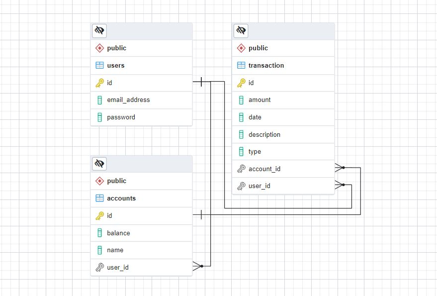

[//]: # (<!-- PROJECT SHIELDS -->)

[//]: # ()
[//]: # ([![Contributors][contributors-shield]][contributors-url])

[//]: # ()
[//]: # ([![Forks][forks-shield]][forks-url])

[//]: # ()
[//]: # ([![Stargazers][stars-shield]][stars-url])

[//]: # ()
[//]: # ([![Issues][issues-shield]][issues-url])

[//]: # ()
[//]: # ([![MIT License][license-shield]][license-url])

[//]: # ([![LinkedIn][linkedin-shield]][linkedin-url])


<!-- PROJECT LOGO -->
<br />
<div align="center">

[//]: # (  <a href="https://github.com/Kieran815/unit-2-project">)

[//]: # (    )

[//]: # (  </a>)

<h1 align="center">Banking API</h1>

  <p align="center">
    A Tool To Manage Your Finances
    <br />
    <a href="https://github.com/Kieran815/unit-2-project/README.md"><strong>Explore the docs »</strong></a>
    <br />
    <br />
    <a href="https://github.com/Kieran815/unit-2-project/issues">Report Bug</a>
    ·
    <a href="https://github.com/Kieran815/unit-2-project/issues">Request Feature</a>
  </p>
</div>


<!-- TABLE OF CONTENTS -->
<details>
  <summary>Table of Contents</summary>
  <ol>
    <li>
      <a href="#about-the-project">About The Project</a>
      <ul>
        <li><a href="#technologies">Technologies</a></li>
        <li><a href="#user-stories">User Stories</a></li>
        <li><a href="#entity-relationship-diagram">Entity Relationship Diagram</a></li>
        <li><a href="#api-endpoints-and-methods">API Endpoints and Methods</a></li>
        <li><a href="#project-board">Project Board</a></li>
        <li><a href="#challenges">Challenges</a></li>
      </ul>
    </li>
    <li>
      <a href="#getting-started">Getting Started</a>
      <ul>
        <li><a href="#prerequisites">Prerequisites</a></li>
        <li><a href="#installation">Installation</a></li>
      </ul>
    </li>
    <li><a href="#usage">Usage</a></li>
    <li><a href="#roadmap">Roadmap</a></li>
    <li><a href="#contributing">Contributing</a></li>
    <li><a href="#license">License</a></li>
    <li><a href="#contact">Contact</a></li>
    <li><a href="#acknowledgments">Acknowledgments</a></li>
  </ol>
</details>


<!-- ABOUT THE PROJECT -->
## About The Project

Banking API was built to help streamline your financial transactions. It has the ability to create and delete accounts, update account descriptions, create transactions that update your account balances, and the ability to pull money from other accounts to prevent over-drafting.

### Technologies
#### Platforms
[](https://www.linux.org/)
[](https://www.microsoft.com/)
[](https://www.apple.com/macos/monterey/)
#### IDE
[](https://www.jetbrains.com/idea/)
#### Language & Frameworks
[](https://www.oracle.com/java/technologies/javase/jdk11-archive-downloads.html)
[](https://spring.io/)
[](https://maven.apache.org/)
[](https://jwt.io/)
[](https://www.postgresql.org/)
[](https://www.postman.com/)
[](https://www.markdownguide.org/)
[](https://git-scm.com/)
[](https://github.com/)
#### Communications & Support
[](https://slack.com/)
[](https://zoom.us/)
[](https://stackoverflow.com/)

### USER STORIES

- As a customer, I want to create a user profile so I can can set up online banking.
- As a user, I want to Login so I can access my accounts.
- As a user, I want to Logout so that I can keep my information secure(?)
- As a user, I want to Check my Balance so I can know how much money I have.
- As a user, I want to be able to Transfer money between my accounts (?)
- As a user, I want to be able to set up a Checking account, so I can have an account to deposit or withdraw money from.
- As a user, I want to be able to set up a Savings account, so I can save money for later use.
- As a user, I want to Deposit money into my SELECTED account so I can add money to my account.
- As a user, I want to Withdraw money from my account so I can spend it.


### Entity Relationship Diagram
<div style="display: flex;">

<div style="padding: 15px; display: flex; flex-direction: column;">

**Project Start:**


</div>

<div style="padding: 15px; display: flex; flex-direction: column;">

**Project Completion:**


</div>


</div>

### API Endpoints and Methods

[***PostMan Request Documentation***](https://documenter.getpostman.com/view/13909137/UVXeqxVH)

| HTTP Method | Endpoint                                             | Functionality                                                             | Access  |
|-------------|------------------------------------------------------|---------------------------------------------------------------------------|---------|
| POST        | /auth/users/register                                 | Registers a user                                                          | PUBLIC  |
| POST        | /auth/users/login                                    | Logs a user in                                                            | PUBLIC  |
| GET         | /api/account                                         | Lists all Account groups                                                  | PRIVATE |
| POST        | /api/account                                         | Creates a new Account group                                               | PRIVATE |
| GET         | /api/account/{accountId}                             | Gets a single Account group with the supplied id                          | PRIVATE |
| PUT         | /api/account/{accountId}                             | Updates an Account group with the supplied id                             | PRIVATE |
| DELETE      | /api/account/{accountId}                             | Deletes a account group with the supplied id                              | PRIVATE |
| GET         | /api/account/{accountId}/transaction                 | List all transactions in the given account                                | PRIVATE |
| POST        | /api/account/{accountId}/transaction                 | Creates a new transaction in the given Account                            | PRIVATE |
| GET         | /api/account/{accountId}/transaction/{transactionId} | Gets a List of transactions with the supplied accountId and transactionId | PRIVATE |
| PUT         | /api/account/{accountId}/transaction/{transactionId} | Updates a transaction in the given account                                | PRIVATE |

### Project Board
Explore our process on our [Banking API: Java Spring RESTful API Project](https://github.com/users/Kieran815/projects/1/views/1)

### Challenges
.gitignore issues

<p align="right">(<a href="#top">back to top</a>)</p>


<!-- GETTING STARTED -->
### Getting Started

This Program requires Java11, Spring, Maven,

#### Prerequisites

* Install Java 11 or Later JDK by following the instructions for [Linux](https://docs.oracle.com/en/java/javase/17/install/installation-jdk-linux-platforms.html#GUID-737A84E4-2EFF-4D38-8E60-3E29D1B884B8), [Windows](https://docs.oracle.com/en/java/javase/17/install/installation-jdk-microsoft-windows-platforms.html#GUID-A7E27B90-A28D-4237-9383-A58B416071CA), or [iOS](https://docs.oracle.com/en/java/javase/17/install/installation-jdk-macos.html#GUID-2FE451B0-9572-4E38-A1A5-568B77B146DE).
    ```sh
      java --version
    ```

* Install Maven by following the instructions [here](https://maven.apache.org/guides/getting-started/maven-in-five-minutes.html). Then, check to verify the installation:
    ```sh
      mvn --version
    ```

#### Installation

1. Clone the repository from Github:
   ```sh
   git clone https://github.com/Kieran815/unit-2-project.git
   ```
   or
    ```sh
    git@github.com:Kieran815/unit-2-project.git
    ```

2. Download and install all pom.xml dependencies.

3. Run through IDE

4. To test the API, install [Postman](https://www.postman.com/downloads/) and review our [Documentation](https://documenter.getpostman.com/view/13909137/UVXeqxVH)

<p align="right">(<a href="#top">back to top</a>)</p>


<!-- USAGE EXAMPLES -->
### Usage

Please Review our _[Postman Documentation](https://documenter.getpostman.com/view/13909137/UVXeqxVH)_ for a complete list of Language Agnostic endpoint interactions.

<p align="right">(<a href="#top">back to top</a>)</p>


<!-- ROADMAP -->
### Roadmap

- [] User Login w/ JWT
    - [] Access to user accounts
        - [] Create Rolling Transactions based on value and balances.

<p align="right">(<a href="#top">back to top</a>)</p>


<!-- CONTRIBUTING -->
### Contributing

Contributions are what make the open source community such an amazing place to learn, inspire, and create. Any contributions you make are **greatly appreciated**.

If you have a suggestion that would make this better, please fork the repo and create a pull request. You can also simply open an issue with the tag "enhancement".
Don't forget to give the project a star! Thanks again!

1. Fork the Project
2. Create your Feature Branch (`git checkout -b feature/AmazingFeature`)
3. Commit your Changes (`git commit -m 'Add some AmazingFeature'`)
4. Push to the Branch (`git push origin feature/AmazingFeature`)
5. Open a Pull Request

<p align="right">(<a href="#top">back to top</a>)</p>

### Coulda/Shoulda/Might
additional functionality to add... later... sometime.

Add billing
auto withdraw

#### Stretch Goal User Stories:

- As a user, I want to be able to set up an Auto Loan account, so I can pay my car note.
- As a user, I want to be able to set up a Credit Card account, so I can build my credit history.
- As a user, I should be able to be assigned a profile for additional functionality over user groups (Admin Privileges).

<!-- LICENSE -->
## License

Distributed under the MIT License.

<p align="right">(<a href="#top">back to top</a>)</p>


## Contact

Kieran Milligan - [@NoLivesMatter42](https://twitter.com/NoLivesMatter42) - kieran.milligan@gmail.com

Habsatou War - [@hwarba](https://twitter.com/hwarba) - hwar@cincinnatistate.edu

Eric Brown - [@KiltedTyger](https://twitter.com/KiltedTyger) - ericbrown589@yahoo.com

Project Link: [https://github.com/Kieran815/unit-2-project](https://github.com/Kieran815/unit-2-project)

<p align="right">(<a href="#top">back to top</a>)</p>


## Acknowledgments

* [Suresh Melvin Sigera](https://www.linkedin.com/in/sureshmelvinsigera/)
* [David Magbee](https://www.linkedin.com/in/davidmagbee/)
* [Usman Basir](https://www.linkedin.com/in/usmanbashir/)

<p align="right">(<a href="#top">back to top</a>)</p>